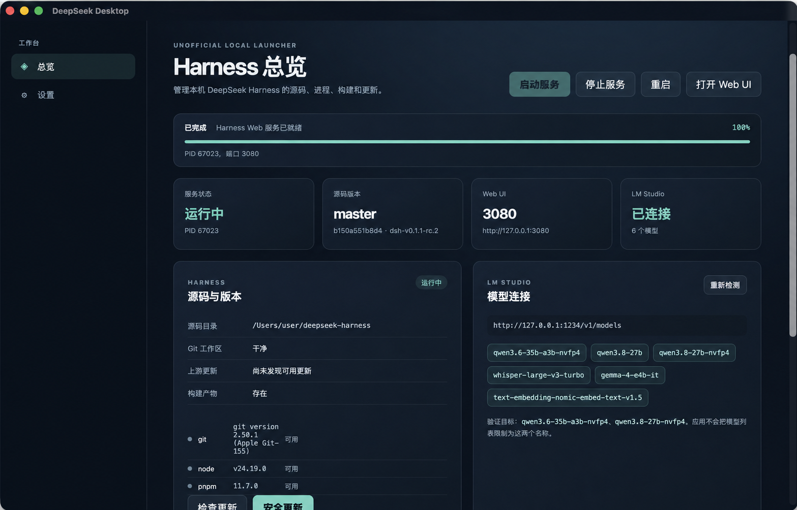
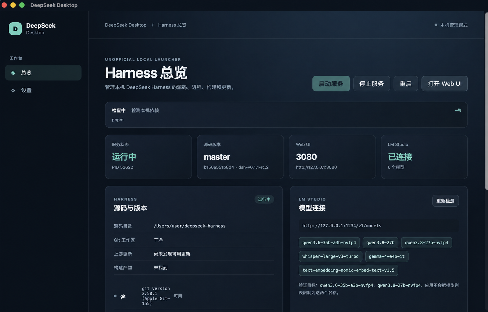
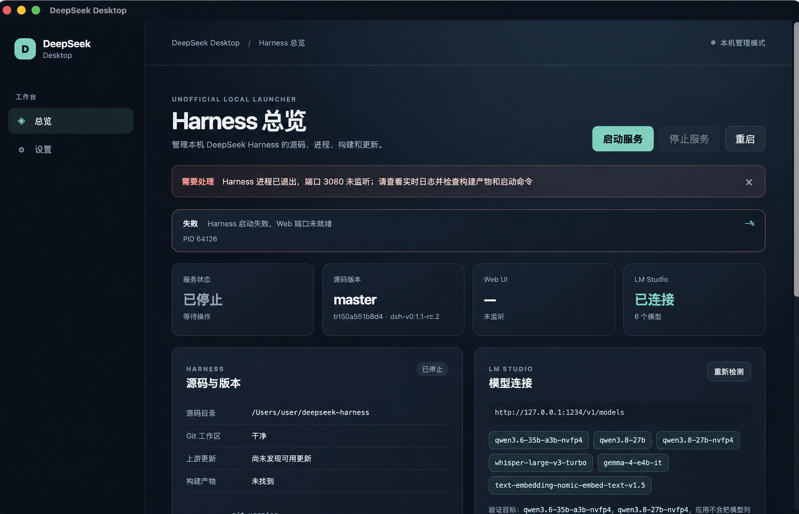

# DeepSeek Desktop

DeepSeek Desktop 是面向本机 DeepSeek Harness 的非官方桌面启动器和生命周期管理器，提供源码准备、依赖检测、构建、启动、停止、更新和 LM Studio 连接管理。

本项目独立维护，与 DeepSeek 官方没有隶属、授权或背书关系。应用只管理用户指定的 Harness 源码目录和本机进程，不修改 Harness 产品代码，不在安装包中重新分发 Harness 源码，也不修改 `~/.dsh`、LM Studio 配置、凭据或用户会话。

## 界面预览

### 运行中的总览页

服务启动后，总览页会显示 Harness 进程、端口、源码版本、构建产物、依赖状态、LM Studio 模型和 Web UI 入口。



### 首次准备与依赖检测

启动前会检查 Git、Node.js、pnpm 和 Harness 构建状态；缺少依赖或构建产物时，可以使用自动准备流程并查看实时进度。



### 异常提示与恢复

如果进程提前退出、端口没有监听或构建失败，应用会保留错误信息和实时日志，并停止后续步骤，方便检查启动命令和构建产物。



> 截图中的本机用户名已脱敏为 `user`；PID、路径和模型列表仅用于演示，实际内容会随机器配置变化。

## 功能概览

- 首次配置 Harness 源码目录、Git URL、分支和 Web 端口；
- 安全执行 `git clone`，不会覆盖非空目录或用户文件；
- 检测 Git、Node.js、pnpm 及版本要求，并显示可执行的修复建议；
- 显式安装系统依赖：macOS 使用 Homebrew，Windows 使用 winget；
- 自动安装 Harness 锁定依赖并构建 Web 产物；
- 启动时自动补齐缺少的 `node_modules` 或构建产物；
- 启动、停止、重启、端口检查、进程记录、遗留进程发现和实时日志；
- 打开 Harness Web UI；
- 安全更新：脏工作区保护、可选备份 stash、fetch、fast-forward 更新、依赖安装、构建清理、重建和条件重启；
- 检测 LM Studio `/v1/models` 并展示已加载模型；
- macOS `.app/.dmg` 和 Windows `.exe/.msi` 构建流程。

## 系统要求

### 运行已打包应用

- macOS Apple Silicon；
- Windows 10/11，建议已安装 WebView2；
- Git；
- Node.js 22.19+（22.x）或 Node.js 24+；
- pnpm 11.7+；
- 可选：运行在 `http://127.0.0.1:1234` 的 LM Studio。

### 本地开发和构建

- Node.js 和 pnpm；
- Rust stable；
- Tauri 2 对应的系统构建依赖；
- Windows 构建需要 Windows runner、MSVC、WebView2 和 Tauri 打包工具。

## 安装和首次使用

1. 打开应用，进入“设置”。
2. 填写 Harness 源码目录、上游 Git URL、分支和 Web 端口。
3. 保存设置。
4. 检查总览页底部的依赖状态。
5. 如果 Git、Node.js 或 pnpm 缺失或版本过低，点击“安装系统依赖”。
   - macOS：使用 Homebrew；
   - Windows：使用 winget；
   - Homebrew 或 winget 本身需要预先安装；
   - 系统安装只会在用户明确点击按钮后执行。
6. 如果 Harness 源码目录不存在，点击“首次安装”。应用会 clone 源码，并自动执行：

   ```text
   pnpm install --frozen-lockfile
   pnpm run build
   ```

7. 如果已有源码但缺少依赖或构建产物，点击“启动并自动准备”。应用会先准备完整运行环境，再启动服务。

默认启动命令为：

```text
pnpm dsh web --no-open
```

默认 Web 端口为 `3080`，与 Harness README 保持一致。

## 总览页按钮说明

| 操作 | 作用 |
| --- | --- |
| 启动服务 | 启动已经准备好的 Harness 服务 |
| 启动并自动准备 | 自动安装依赖、构建产物，然后启动服务 |
| 停止服务 | 发送中断信号并等待端口释放 |
| 重启 | 安全停止后重新启动服务 |
| 打开 Web UI | 打开 `http://127.0.0.1:3080` |
| 安装系统依赖 | 安装或修复 Git、Node.js、pnpm |
| 安装依赖并构建 | 手动重新执行 Harness 依赖安装和构建 |
| 检查更新 | 检查远程仓库和当前分支状态 |
| 安全更新 | 按安全更新流程拉取、构建并按需重启 |

## Finder 和 Windows 环境支持

macOS 从 Finder 启动 `.app` 时，通常不会继承交互式终端的完整 `PATH`。应用会读取登录 Shell 的 PATH，并搜索常见的 NVM、Homebrew、Volta 和 pnpm 路径，因此从 Finder 启动不需要额外打开终端。

Windows 额外支持：

- `.exe`、`.cmd`、`.bat` 命令包装器；
- npm 和 pnpm 常见安装目录；
- WMIC 不可用时使用 PowerShell 查询进程命令行；
- 使用 `taskkill` 处理 Harness 子进程树；
- Windows runner 自动构建 NSIS `.exe` 和 MSI 安装包。

如果工具安装在自定义位置，可以在“设置”中填入可执行文件的绝对路径。

## LM Studio

默认 API 地址为：

```text
http://127.0.0.1:1234/v1/models
```

地址可以在“设置”中修改。界面会展示返回的模型 ID 和连接错误。当前验证目标包括 `qwen3.6-35b-a3b-nvfp4` 和 `qwen3.8-27b-nvfp4`，但它们不是白名单，应用不会限制其他模型名称。请求不会附带 API Key，日志会脱敏常见的授权和密钥字段。

## 安全启停和更新

应用会把自己的设置和运行态保存到操作系统应用数据目录。运行态包含 PID、命令、源码路径、端口和启动时间。再次打开应用时，会检查保存的 PID、命令行和源码目录，避免误操作被复用的 PID。

停止服务时：

1. 向受管进程组发送中断信号；
2. 等待端口释放；
3. 必要时发送 TERM；
4. 超时后停止后续操作，保留现场和日志。

普通停止不会使用 `kill -9`。更新流程遇到错误会立即停止后续步骤，不会执行 `reset`、强制 checkout、递归删除源码目录或自动 `stash pop`。

## 常见问题

| 现象 | 处理方式 |
| --- | --- |
| `127.0.0.1:3080` 拒绝连接 | 回到应用点击启动，查看实时日志和端口状态 |
| Harness 进程已退出 | 检查构建产物、Node.js/pnpm 版本和启动命令 |
| 找不到 Git、Node.js 或 pnpm | 点击“安装系统依赖”，或在设置中填写绝对路径 |
| `fatal: couldn't find remote ref main` | 检查分支设置；Harness 默认分支可能是 `master` |
| 构建产物未找到 | 点击“启动并自动准备”或“安装依赖并构建” |
| LM Studio 不可达 | 确认 LM Studio 正在运行，并检查 `/v1/models` 地址 |
| Windows 打包失败 | 确认 Tauri 图标资源包含 `src-tauri/icons/icon.ico`，并在 Windows runner 上构建 |

## 开发

```bash
git clone https://github.com/simonwang95/DeepSeek-Desktop.git
cd DeepSeek-Desktop
pnpm install
pnpm tauri:dev
```

只预览浏览器界面：

```bash
pnpm dev
```

浏览器预览不具备 Tauri 的进程管理能力，会显示桌面后端不可用提示。

## 检查命令

```bash
pnpm typecheck
pnpm test
cargo test --manifest-path src-tauri/Cargo.toml
pnpm build
pnpm tauri:build
```

macOS 构建：

```bash
pnpm tauri:build
open "src-tauri/target/release/bundle/macos/DeepSeek Desktop.app"
```

`pnpm tauri:build` 在 macOS 上会先构建 `.app`，再使用项目内的 DMG 兜底打包器生成压缩的 `.dmg`。该流程不需要 `hdiutil` 挂载可写虚拟磁盘设备，因此适用于受管控或沙箱化的 macOS 环境。单独重新打包已有 `.app` 可运行：

```bash
pnpm tauri:build:dmg
```

如果直接执行 `pnpm tauri build`，会绕过项目内兜底打包器并调用 Tauri 默认的 `bundle_dmg.sh`；在没有磁盘映像设备权限的环境中可能出现 `hdiutil: create failed - 设备未配置`。请使用上面的 `pnpm tauri:build`。

Windows 构建由 GitHub Actions 的 `windows-2022` 任务执行。推送到 `dev` 或 `main`，或者手动运行 `CI` workflow 后，可以在构建产物 `DeepSeek-Desktop-Windows` 中下载 `.exe` 和 `.msi`。

## 发布和仓库边界

Harness 源码更新使用配置的 Git 远程仓库和本地安全更新状态机；DeepSeek Desktop 自身更新预留 GitHub Releases。正式发布前需要配置签名、公证、updater 密钥和 GitHub Actions secrets，凭据不能提交到仓库。

`DeepSeek-Desktop` 是独立 Git 仓库。被管理的 `deepseek-harness` 是用户指定的外部目录，桌面应用源码绝不能加入其中。应用只读参考 Harness README、Git 元数据、配置和命令输出，不会向 Harness 仓库添加桌面文件。

相关文档：[English README](README.en.md)、[贡献指南](CONTRIBUTING.md)、[安全策略](SECURITY.md)。
